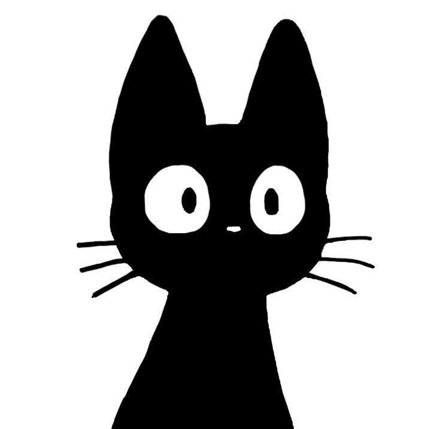

<!-- Somente funciona no tema escuro -->

  <b>‹ Este perfil só funciona no tema escuro do GitHub ›</b>

<h1 align="center">Olá, tudo bem? Me chamo Sword</h1>

   Bem-vindo ao meu perfil!

---

## > neofetch

  
---
## 📊 GitHub Status

| Meus Projetos | Estatísticas |
|--|--|
| [Projeto 1] Working

| Servers Que trabalho |

| [Server 1](https://discord.gg/4dUVJf4YSe)
---

  

---

  

